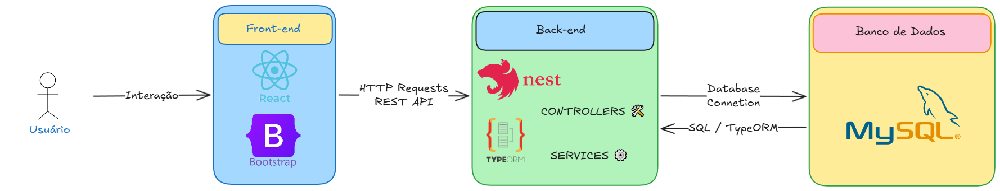

# 🎯 Jogo-Do-BichoFull

O **BichoFull** é uma aplicação web **Full Stack** desenvolvida para fins educacionais.  
O sistema permite que usuários:

- Criem contas
- Gerenciem uma carteira virtual
- Realizem apostas simuladas
- Tenham seus resultados processados automaticamente

> ⚠ Projeto acadêmico – sem fins comerciais.

---

## 🛠 Tecnologias Utilizadas

## 🎨 FRONTEND


## 🧠 BACKEND


---

## 🏗 Arquitetura do Sistema



---

## 📌 Contrato inicial da API - Endpoints de Autenticação

## 🔐 Autenticação

| Método | Endpoint        | Descrição                                       |
|--------|----------------|-------------------------------------------------|
| POST   | `/auth/register` | Cria um novo usuário com saldo inicial.       |
| POST   | `/auth/login`    | Autentica o usuário e retorna um JWT Token.   |
| GET    | `/auth/me`       | Retorna dados do usuário autenticado.         |

---

## 💰 Carteira

| Método | Endpoint            | Descrição                                  |
|--------|---------------------|--------------------------------------------|
| GET    | `/wallet/balance`   | Retorna o saldo atual do usuário.          |
| GET    | `/wallet/history`   | Histórico de ganhos e perdas.              |

---

## 🎲 Apostas

| Método | Endpoint         | Descrição                                               |
|--------|------------------|---------------------------------------------------------|
| POST   | `/bets`          | Realiza uma nova aposta (desconta do saldo).            |
| GET    | `/bets/my-bets`  | Lista apostas realizadas pelo usuário autenticado.      |

---

## 🎯 Sorteios

| Método | Endpoint          | Descrição                                          |
|--------|------------------|----------------------------------------------------|
| GET    | `/draws/latest`  | Retorna o último resultado sorteado.               |
| GET    | `/draws/history` | Lista os últimos 10 sorteios realizados.           |

---

## 📦 Exemplos de Payload

## 🎲 POST `/bets`

Cria uma nova aposta.

### 📥 Request Body

```json
{
  "value": 10.00,
  "type": "MILHAR",
  "numbers": "1234"
}
```

📚 Sobre o Projeto

Este projeto foi desenvolvido para fins educacionais na disciplina de:

**Laboratório de Produção de Software**

👨‍🏫 Professor: Ronem Lavareda

🏫 IFAM – Campus Parintins-AM
