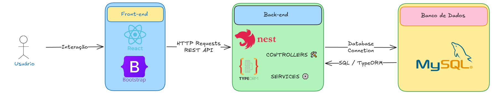

# 🎯 Jogo-Do-BichoFull

O **BichoFull** é uma aplicação web **Full Stack** desenvolvida para fins educacionais.  
O sistema permite que usuários:

- Criem contas
- Gerenciem uma carteira virtual
- Realizem apostas simuladas
- Tenham seus resultados processados automaticamente

> ⚠ Projeto acadêmico – sem fins comerciais.

---

## 🛠 Tecnologias Utilizadas

## 🎨 FRONTEND


* **React + Vite**: Biblioteca para interfaces modernas e rápidas.
* **Bootstrap 5**: Estilização e componentes responsivos.
* **Axios**: Cliente HTTP para consumo da API.
* **React Router Dom**: Gerenciamento de rotas.
## 🧠 BACKEND


* **NestJS**: Framework Node.js para aplicações eficientes e escaláveis.
* **TypeORM**: ORM para integração com banco de dados.
* **MySQL**: Banco de dados relacional.
* **TypeScript**: Tipagem estática para maior segurança no código.
---

## 🏗 Arquitetura do Sistema



---

## 📌 Contrato inicial da API - Endpoints de Autenticação

## 🔐 Autenticação

| Método | Endpoint        | Descrição                                       |
|--------|----------------|-------------------------------------------------|
| POST   | `/auth/register` | Cria um novo usuário com saldo inicial.       |
| POST   | `/auth/login`    | Autentica o usuário e retorna um JWT Token.   |
| GET    | `/auth/me`       | Retorna dados do usuário autenticado.         |

---

## 💰 Carteira

| Método | Endpoint            | Descrição                                  |
|--------|---------------------|--------------------------------------------|
| GET    | `/wallet/balance`   | Retorna o saldo atual do usuário.          |
| GET    | `/wallet/history`   | Histórico de ganhos e perdas.              |

---

## 🎲 Apostas

| Método | Endpoint         | Descrição                                               |
|--------|------------------|---------------------------------------------------------|
| POST   | `/bets`          | Realiza uma nova aposta (desconta do saldo).            |
| GET    | `/bets/my-bets`  | Lista apostas realizadas pelo usuário autenticado.      |

---

## 🎯 Sorteios

| Método | Endpoint          | Descrição                                          |
|--------|------------------|----------------------------------------------------|
| GET    | `/draws/trigger`  | Executa o sorteio e processa ganhadores.               |
| GET    | `/draws/history` | Lista os últimos resultados sorteados.           |

---

## 📦 Exemplos de Payload

## 🎲 POST `/bets`

Cria uma nova aposta.

### 📥 Request Body

```json
{
  "value": 10.00,
  "type": "GRUPO",
  "chosenNumber": "05"
}
```
## 🚀 Como Executar o Projeto e Configuração do Ambiente 🔧
Siga os passos abaixo para configurar o ambiente localmente.

### 1. Clonando o Repositório
```bash
git clone [https://github.com/Carvalho-TJ/Jogo-Do-BichoFull.git](https://github.com/Carvalho-TJ/Jogo-Do-BichoFull.git)
```
**Entre na pasta**:
```
cd Jogo-Do-BichoFull
```
## 2. Configurando o Banco de Dados (MySQL)
* Crie um banco de dados vazio chamado bichofull_db.
* Certifique-se de que o serviço do MySQL está rodando.

## 3. Configurando o Backend (NestJS)
**Entre na pasta do Backend**:
```
cd backend
```
Instale as depenedencias:
```
npm install
```
Dentro da pasta /backend/database/.env.example altere as informações do arquivo com as seguintes credenciais:
Caso não tenha, Crie um arquivo .env na raiz da pasta /backend
```
DB_HOST=localhost
DB_PORT=3306
DB_USER=seu_usuario_mysql
DB_PASSWORD=sua_senha_mysql
DB_NAME=bichofull_db
```
## 🚀 Inicie o servidor Backend
```
npm run start:dev
```
## 4. Configurar o Frontend
**Abra um novo terminal e navegue até a pasta do cliente**:
```
cd frontend
```
Instale as depenedencias:
```
npm install
```
## 🚀 Inicie o servidor Frontend
```
npm run dev
```
Acesse a aplicação em: http://localhost:5173 (ou a porta indicada pelo Vite).

---

📚 Sobre o Projeto

Este projeto foi desenvolvido para fins educacionais na disciplina de:

**Laboratório de Produção de Software**

👨‍🏫 Professor: Ronem Lavareda

🏫 IFAM – Campus Parintins-AM

👤 Tiago Ribeiro Carvalho
